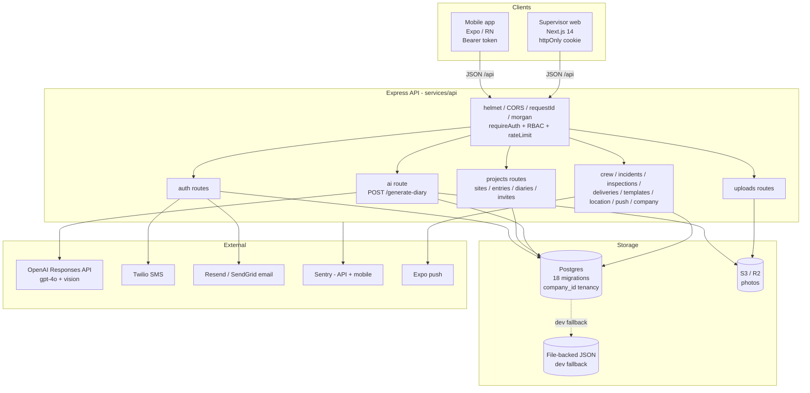

# SiteSnap AI — Architecture (Phase 1 Discovery)

> Factual record of the codebase as of commit `cc63dc2` (main). Observations only — no recommendations (those belong to `docs/AUDIT.md`, Phase 2).

## 1. Repository layout

The repo root is a thin wrapper; the real monorepo lives under `Projects/`.

| Path | Responsibility |
|---|---|
| `/` (root) | Dockerfile (API container build), `.dockerignore`, `.github/workflows/` (CI, deploy, mobile build), `docs/`, `live-migration-bundle.sql` (untracked one-off prod-DB rebuild script) |
| `Projects/` | pnpm workspace root: `package.json`, `pnpm-workspace.yaml`, shared tsconfig, eslint |
| `Projects/apps/mobile` | Expo / React Native field app (expo-router, SDK 54, React 19, RN 0.81) — the primary capture client |
| `Projects/apps/supervisor-web` | Next.js 14 (app router, React 18) supervisor portal on port 3001 |
| `Projects/services/api` | Express 4 + TypeScript API — auth, projects, AI generation, uploads, RBAC; the only backend |
| `Projects/shared` | Zod schemas + shared TS types, published to the workspace as `@sitesnap/shared` (emits `.d.ts` only) |
| `Projects/docs` | `api-contracts.md`, `production-readiness.md`, `SiteSnap-Release-Runbook.md` |
| `Projects/scripts` | `build.js` helper |
| `Projects/services/api/src/storage/migrations` | 18 ordered `.sql` migrations (001→018), applied by a version-tracking runner at API boot |
| `.github/workflows` (root) | `ci.yml` (lint+typecheck+test), `deploy-api.yml` (tests then container build — registry push commented out), `build-mobile.yml` |

There is **no CLAUDE.md** in the repo. Root `README.md` is one line (`# SiteSnap-AI`).

## 2. Runtime stack

- **API**: Node 22 (Docker) / Node ≥20, Express 4.22, TypeScript 5.9, `pg` 8, `zod` 3, `openai` 6.22, `@aws-sdk/client-s3`, `@sentry/node` 10, `helmet`, `morgan`, `multer`, `ioredis` (rate limiting when `REDIS_URL` set). Built with `tsc`, run as `node dist/server.js`.
- **Mobile**: Expo SDK 54, expo-router 6, React 19.1, React Native 0.81.5, `@tanstack/react-query` (installed; data layer is actually a hand-rolled context), AsyncStorage, expo-image-manipulator/picker/print/sharing, `@sentry/react-native`.
- **Web**: Next.js 14.2 app router, React 18.3, react-leaflet (worker map). No UI framework — hand-rolled components.
- **Package manager**: the repo commits a **pnpm** setup — `pnpm-lock.yaml` (the only lockfile) and `pnpm-workspace.yaml`, and the Dockerfile builds with `corepack prepare pnpm@10.30.3`. **Deployment discrepancy (2026-07-26):** the running Render service shows a **hoisted `node_modules`** layout (Yarn/npm behaviour) at `/repo/Projects`, which pnpm's default symlinked linker does not produce — so the Render deploy does **not** appear to run the repo's pnpm/Docker path. This mismatch (deploying with a different package manager than the committed lockfile) should be reconciled; it is a real risk, not just a doc nit. Local dev and CI use pnpm (`pnpm -C Projects …`).

## 3. Data layer

- **Postgres** (production, via `DATABASE_URL`) with a **file-backed JSON fallback** (`storage/local.ts`, `FileBackedStore`) used in dev when no DB configured. Stores are hand-written SQL modules — no ORM: `projectsStore` (1,536 lines: sites, entries, diaries, templates, invites, members), `authStore` (742), plus per-feature stores (crew timecards, incidents, inspections, deliveries, push tokens, locations).
- **Migrations**: `migrate.ts` reads `dist/storage/migrations/*.sql` in filename order, tracks in `schema_migrations` (version = filename minus `.sql`), runs at boot inside `bootstrap()`. Dockerfile explicitly copies the `.sql` files into the runtime image (tsc doesn't).
- **Schema highlights**: `auth_users` keyed by **email** (primary key, not id); soft multi-tenancy via `company_id TEXT` columns on every operational table (migrations 014–018) with **no FK** to `companies` (deliberate: soft-cancel compliance, 7-year retention). UUIDv7 ids for records. Soft deletes on sites (`deleted_at`). Diary `edit_log` JSONB audit trail.
- **Photos**: S3-compatible object storage (S3/R2 via env-var soup in `mediaStorage.ts`) in production, local disk in dev. Uploaded via multipart `POST /api/uploads` (multer, magic-byte validation, 30/hr rate limit), served via signed URLs (`/api/uploads/sign` batches 50, 2-hr TTL server / 90-min client cache).

## 4. LLM integration (every call site)

There is exactly **one production LLM call site**: `services/api/src/routes/ai.ts` → `tryGenerateWithOpenAI()` → `client.responses.create()` (OpenAI Responses API).

- **Provider/model**: OpenAI, `OPENAI_MODEL` env or default `"gpt-4o"`. Client singleton in `services/openaiClient.ts` (90 s timeout, 2 retries).
- **Endpoint**: `POST /api/generate-diary` (auth required, 10/hr/user rate limit). Two request shapes: `{siteId, period}` (server loads entries) or `{site, period, entries[]}` (client-pushed payload, ≤50 entries).
- **Prompt**: single `SYSTEM_PROMPT` string literal in `ai.ts` (~50 lines: QS persona, photo-analysis rules, British English, JSON output contract). Per-photo instruction text is a second inline template in `buildVisionInputs()`. No versioning, no external prompt store.
- **Vision**: up to 12 images per request, base64 data-URIs (`detail: "auto"`), read back from media storage when the client sends `storageKey` instead of base64.
- **Output handling**: `json_object` response format, `JSON.parse`, then field-by-field normalisation against a deterministic fallback (`buildDiaryFromEntries()` — a pure rule-based generator that never invents content). Checklist items <10 chars dropped; <3 items → fallback checklist. Any parse/API failure → local generator with a `warning` string surfaced to the client (401/429 distinguished).
- **Dead code**: `services/aiService.ts` (`AIServiceSync`, rule-based draft with a different shape from `@sitesnap/shared/schemas/entry`) is imported nowhere in routes.
- Temperature 0.3. **No streaming.** No token/cost logging. No eval harness. No prompt-injection guard on user notes/captions beyond the JSON output contract.

## 5. Auth, tenancy, data boundaries

- **Token**: custom HMAC-SHA256 JWT (`utils/authToken.ts`), 7-day TTL, `token_generation` claim enables revoke-all-devices. Claims: email, fullName, companyId, companyRole (+legacy role).
- **Transport**: mobile sends `Authorization: Bearer` (token in AsyncStorage); web uses `sitesnap.session` **httpOnly cookie** (set by API, `credentials: "include"`). `requireAuth` accepts either.
- **Registration**: two-step — `initiate` (email + SMS codes via Resend/SendGrid + Twilio) then `verify`. Password: scrypt + timing-safe compare. Forgot/reset-password flows on both clients.
- **RBAC**: company roles `owner > manager > viewer > crew` (`requireAtLeast`, `requireCompanyRole`); legacy `worker/supervisor/admin` role retained in parallel with deprecated mapping helpers. Tenancy enforced in store queries by `companyId` + role (an `Actor` object threaded through every store call).
- **Rate limiting**: bespoke middleware, per-account + per-IP with env-tunable limits, Redis when available, in-memory otherwise (resets on restart — logged as a known caveat at boot).

## 6. Component diagram

## 7. Core user journeys

### A. Capture entry (mobile, offline-capable)

1. `apps/mobile/app/new-entry.tsx` — form (date/weather/crew/notes) with 1.5 s-debounced draft autosave (`lib/draft-store.ts`); camera/library via expo-image-picker; every photo resized to ≤1280 px, JPEG q0.55, base64 kept in memory (`createStoredPhoto`).
2. Submit → `lib/data-context.tsx` `addEntry()`:
   - `uploadPhotos()` — per-photo POST `/api/uploads` with 3-attempt backoff (1 s/2.5 s/5 s); base64 payloads persisted locally via `lib/photo-payload-store.ts`, stripped before JSON calls.
   - `POST /api/projects/entries` → `routes/projects.ts:160` → `projectsStore.createEntry` → Postgres.
   - **Network failure** → optimistic local entry (`pending-` id, `isPending`), photos+op queued (`lib/offline-queue.ts`, AsyncStorage), drained on next `refresh()`; non-network errors drop the op.
3. Read path: `GET /api/projects/bootstrap` (sites+entries+diaries in one call) → per-user AsyncStorage cache → signed photo URLs batch-attached.

Files: `new-entry.tsx`, `data-context.tsx`, `offline-queue.ts`, `photo-payload-store.ts`, `draft-store.ts`, `api-base-url.ts`, `auth-context.tsx` (token refresh), API `routes/uploads.ts`, `routes/projects.ts`, `storage/projectsStore.ts`, `storage/mediaStorage.ts`.

### B. Generate diary report (the AI journey)

1. `apps/mobile/app/diary/[siteId].tsx` `handleGenerate()` → `POST /api/generate-diary {siteId, period}`.
2. If the server has no entries for that site (offline-created data not yet synced) the client **retries with full local entries + base64 photos** in the body.
3. API `routes/ai.ts`: zod-validate → resolve entries (server-side load + period filter, or client payload) → `buildVisionInputs` (≤12 base64 images) → OpenAI `responses.create` (system prompt + JSON payload + images) → parse/normalise with deterministic fallback on any failure.
4. Client stores result via `data-context addDiary()` (optimistic, then `POST /api/projects/diaries`, rollback on failure). Diary status `draft` → approve flow adds `edit_log` entries server-side.
5. User sees a spinner (`generating` state) for the full round-trip — no streaming, no progress.

Files: `diary/[siteId].tsx`, `data-context.tsx`, API `routes/ai.ts`, `services/openaiClient.ts`, `storage/projectsStore.ts`, `storage/mediaStorage.ts`.

### C. Export / share report

1. `diary/[siteId].tsx` → `lib/export-utils.ts`: report → HTML template → `expo-print printToFileAsync` (PDF) or HTML-as-.doc → `expo-sharing shareAsync`. Entirely client-side; no server export endpoint.

### D. Supervisor review (web)

1. Login `app/page.tsx` → `POST /api/auth/login` → httpOnly cookie; profile in localStorage (display only).
2. `lib/useBootstrap.ts` → `GET /api/projects/bootstrap`; dashboard/sites/reports/activity pages render from that one payload; `useRole` gates admin UI (Team page → `/api/company/*` owner/manager endpoints); worker map from `/api/location/workers`.

## 8. Build, deploy, environments

- **API deploy**: Render, from the repo directly (`deploy-api.yml` runs tests + typecheck; container registry push is commented out). The root `Dockerfile` describes a 3-stage pnpm build, but per the package-manager discrepancy noted in §2 the live Render build appears to hoist `node_modules` (Yarn/npm-style) rather than use the pnpm/Docker path — confirm which builder Render actually runs. Live URL `https://sitesap-ai.onrender.com` (old spelling; GitHub repo renamed SiteSnap-AI).
- **Production database**: Render-hosted PostgreSQL, reached via a Render **internal** hostname (`dpg-…-a` form in `DATABASE_URL`), which only resolves inside Render's private network. An external connection string (`dpg-…-a.<region>-postgres.render.com`) is a separate, optionally-enabled endpoint — confirm in the Render dashboard whether external access is enabled/IP-restricted.
- **Env config**: `validateProviderConfig()` hard-fails production boot on missing/placeholder `AUTH_TOKEN_SECRET`, `DATABASE_URL`, email, SMS, or S3 config. Dev degrades to warnings + local fallbacks. `OPENAI_API_KEY` is *not* validated at boot — absence silently downgrades AI generation to the rule-based generator.
- **Mobile**: EAS build config expected (`eas.json` referenced; `extra.eas.projectId` is a `FILL-AFTER-eas-init` placeholder). Release builds throw if `EXPO_PUBLIC_API_BASE_URL` is unset or non-HTTPS. expo-updates installed; OTA config not finished.
- **Web**: no deploy workflow found (assumed manual / not yet deployed).

## 9. Test coverage

- **API**: 8 test files (`node --test` on compiled dist): ai generation fallback, change-password, company RBAC (37 assertions green as of PR #11), invites, 2 e2e flows, integration, authToken unit. Pre-commit hook runs typecheck + lint + full tests.
- **Mobile: zero tests. Web: zero tests. Shared: zero tests.**
- No eval harness for LLM output quality; `ai.test.ts` exercises the deterministic fallback path, not live generation.

## 10. Observed facts (plain list)

1. One LLM call site total; prompt is an inline string literal; model default `gpt-4o` via env override; temp 0.3; JSON-object mode (not strict JSON schema); no streaming; no token/latency/cost logging beyond Sentry errors and a `payloadBytes` log on failure.
2. Every AI failure path degrades to a deterministic local generator that only re-arranges user-entered text — the fallback cannot hallucinate but the primary path has no grounding checks beyond the system prompt's instructions and post-hoc field normalisation.
3. Photos travel as base64 JSON in the AI retry path (client → API), and separately as multipart uploads in the normal entry path; `express.json` limit is 25 MB to accommodate this.
4. Mobile keeps full-resolution-compressed base64 for every photo in AsyncStorage (`photo-payload-store`) alongside uploaded copies in S3.
5. Auth users are keyed by email (PK); company tenancy is soft (`company_id` TEXT, no FKs); all store functions take an `Actor` and filter by company + role.
6. Offline queue covers add/update/delete of entries and sites; diaries are optimistic-with-rollback only (a failed diary save while offline is lost after rollback); templates/incidents/inspections/deliveries have no offline path.
7. Rate limiting, dedupe, and session revocation are in-memory unless `REDIS_URL` is set; single-instance deploy assumed.
8. `@tanstack/react-query` is a mobile dependency but the data layer is a hand-rolled context + AsyncStorage cache; `lib/api.ts` (`ApiClient`) and `services/aiService.ts` appear to be dead code; `utils/logger.ts` (dev logger) is superseded by morgan.
9. Two `.github/workflows` trees exist (root and `Projects/`); the root one is authoritative for deploy.
10. `docs/api-contracts.md` predates the RBAC migration (documents legacy worker/supervisor roles only, missing ~40 newer endpoints).
11. Migration bundle `live-migration-bundle.sql` sits untracked at repo root; it duplicates migrations 001–018 for a one-off manual prod rebuild.
12. Web portal talks to the API with cookies and default `NEXT_PUBLIC_API_URL http://localhost:4001`; mobile default LAN fallback is `http://192.168.4.28:4001`; the API listens on 4000 by default — three different ports in defaults.
13. Sentry wired on API (`instrument.ts`, Express error handler) and mobile (`@sentry/react-native`, org/project config placeholders); no Sentry on web.
14. Pre-commit hook runs the full API test suite; suite currently red when Twilio-dependent tests run without SMS quota (external dependency in tests).
